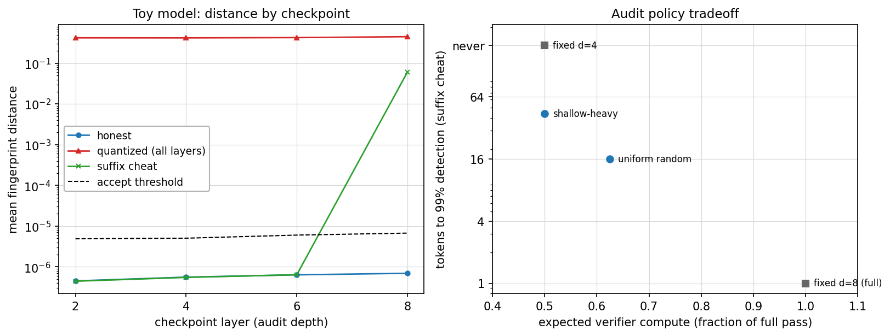
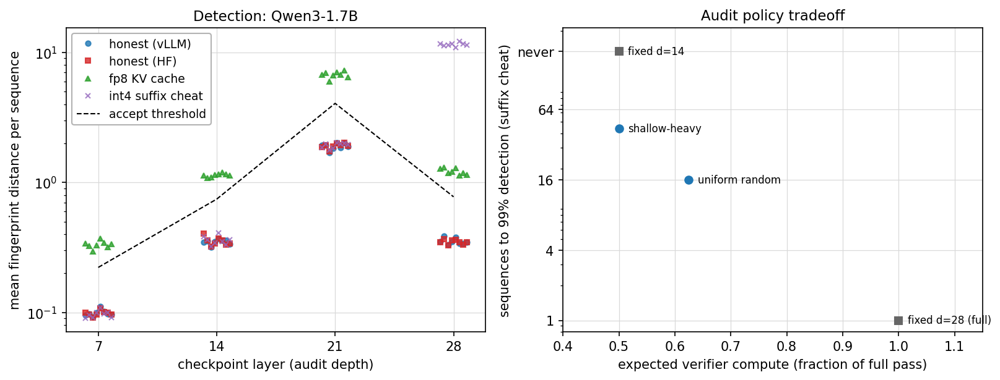
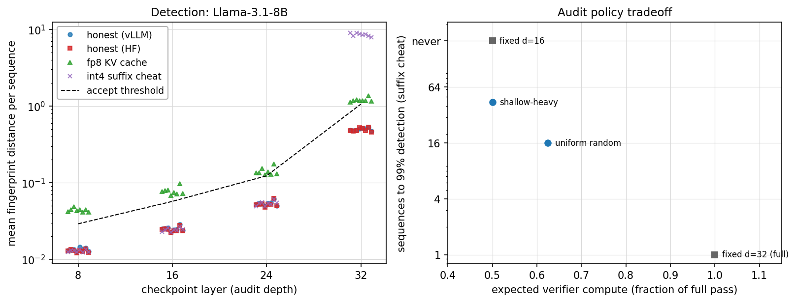
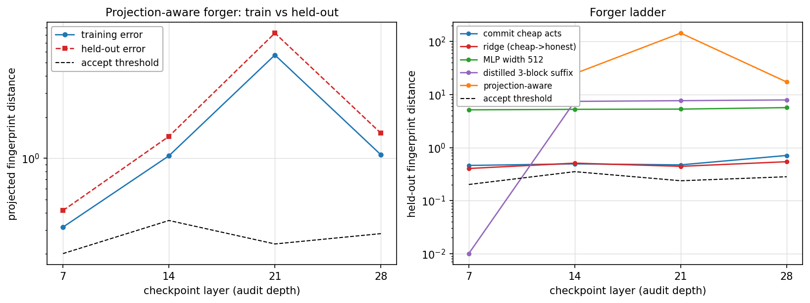

# difr-mid: randomized-depth multi-checkpoint Activation-DiFR

> Work done during the Hardware Assurance Program work week @ CAISH (Aug 17-22 2026)

[Activation-DiFR](https://arxiv.org/abs/2511.20621) (Karvonen et al.) verifies
a provider's forward pass by comparing JL-projected fingerprints of hidden
states against a recomputation. Detection is strong (AUC > 0.999 for 4-bit
quantization in ~2 tokens), but the verifier pays a full-depth forward pass per
audited token.

Modification tested here: the prover fingerprints the residual stream at
quarter-depth checkpoints instead of only the final layer. The verifier draws
an audit depth `d ~ π`, recomputes layers `1..d`, and checks all checkpoints
`≤ d`. Expected verifier compute is `E[d]/L` of a full pass. The depth must be
random: a fixed shallow audit at depth `d` never detects a cheater that is
honest through layer `d` and cheap after ("suffix cheat"). With random depth,
a cheat in segment `(c_{i-1}, c_i]` is caught with per-token probability
`P_π(d ≥ c_i)`, so escape probability decays geometrically over audited tokens.

Protocol, threat model, and experiment details: [docs/WRITEUP.md](docs/WRITEUP.md).
Forgery attack analysis: [docs/forgery-attack-analysis.md](docs/forgery-attack-analysis.md).
Known limitations: [docs/WRITEUP.md §6](docs/WRITEUP.md).

## Results

### Toy model (`experiments/run_demo.py`)

8-layer GPT, checkpoints at layers 2/4/6/8, 24 prompts. Left: a cheater
quantized at every layer exceeds threshold at every checkpoint; the suffix
cheat (honest through layer 6) matches honest distances until layer 8. Right:
detection-vs-compute for four audit policies.

| audit policy | E[compute] | detects suffix cheat | tokens to 99% |
|---|---|---|---|
| fixed d=4 | 0.50 | no | ∞ |
| shallow-heavy | 0.50 | yes | ~44 |
| uniform random | 0.625 | yes | ~16 |
| fixed d=8 (full) | 1.00 | yes | 1 |

Fixed d=4 and shallow-heavy cost the same; only the randomized policy detects
the suffix cheat.

### Qwen3-1.7B (`experiments/run_detection.py`)

vLLM prover, HF teacher-forced verifier. 28 layers, checkpoints 7/14/21/28,
k=32, 8 prompts × 64 tokens. Thresholds = 2× max honest per-sequence mean
distance, per prover family. Per-sequence flag rates:

| depth | honest (vLLM) | honest (HF) | fp8 KV | int4 suffix (honest ≤ 21) |
|---|---|---|---|---|
| 7  | 0 | 0 | 1.0 | 0 |
| 14 | 0 | 0 | 1.0 | 0 |
| 21 | 0 | 0 | 1.0 | 0 |
| 28 | 0 | 0 | 1.0 | 1.0 |

fp8-KV corruption affects every layer, so a depth-7 audit (25% of full
verifier compute) catches it. The suffix cheat is only visible at the final
checkpoint. Policy tradeoff matches the toy model.

### Llama-3.1-8B (`experiments/run_detection.py` with `DIFR_MODEL`)

32 layers, checkpoints 8/16/24/32, suffix cheat honest through layer 24
(quantizes the untied `lm_head` too). Same pattern as 1.7B with wider margins:
honest 0 flags at every depth; fp8-KV flagged 100% at every depth; suffix
cheat at 0.012–0.06 through layer 24, then 7.9–9.0 at layer 32 against a
threshold of 1.06.

### Forgery sweep (`experiments/run_forgery_sweep.py`)

Setup: an int8 model serves tokens; the verifier recomputes the honest model
on those served tokens; forgers trained on ~20k tokens (600 sequences) try to
produce passing fingerprints. Ladder: corpus mean, copy cheap activations,
ridge cheap→honest, MLPs (width 64/512), honest-to-layer-7 plus a distilled
1-/3-block suffix, and projection-aware regressors targeting the public
projection. Held-out median distance vs threshold:

| checkpoint | threshold | F0-copy | F1-ridge | F2-mlp512 | F3-distill3b | F4-projaware |
|---|---|---|---|---|---|---|
| 7  | 0.20 | 0.46 | 0.40 | 5.15 | 0.00 | 7.23 |
| 14 | 0.35 | 0.49 | 0.51 | 5.26 | 7.43 | 24.84 |
| 21 | 0.24 | 0.47 | 0.44 | 5.31 | 7.67 | 144.38 |
| 28 | 0.28 | 0.71 | 0.54 | 5.67 | 7.91 | 17.24 |

No forger cheaper than an honest pass is under threshold at every checkpoint.
F3-distill3b passes layer 7 because it computes layer 7 honestly, then fails
at 14/21/28. Left panel: the projection-aware forger's training error is
itself above threshold past layer 7 — the deep activations are not a learnable
function of cheap or shallow features at this scale, so more training data
does not change the outcome.

